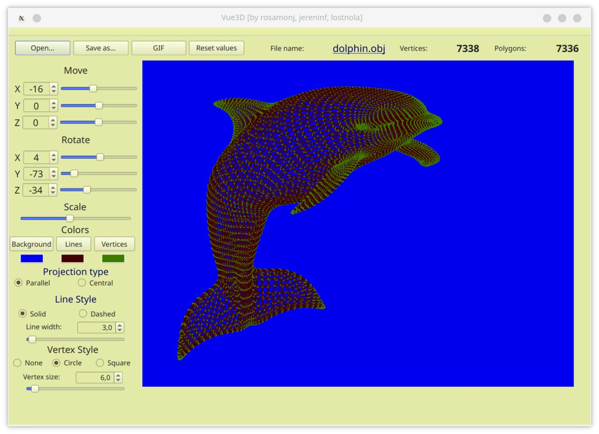

# 3D Viewer (QT + OpenGL + C)  {#mainpage}
> Created by lostnola jereninf rosamonj
> School 21 (Kazan)

## Overview
This program is designed to visualize wireframe models in three-dimensional space, is written in C11 and supports various GUI libraries.





## The program allows you to:
- Load a wireframe model from an object file 
- Move the model by a specified distance relative to the X, Y, Z axes
- Rotate the model by a given angle relative to its axes X, Y, Z
- Scale the model by a given value.
- Adjust the projection type (parallel and central)
- Customize the type (solid, dashed), the color and thickness of the edges, the display method (none, circle, square), color and size of vertices
- Choose a background color
- Save settings between program restarts
- Save the received ("rendered") images to BMP and JPEG
- Use a special button to record small "screencasts" - current user affine transformations of the loaded object into gif-animation (640x480, 10fps, 5s)

## Build and istallation
**To install and execute the program, use the following commands:**
- make - install and execute
- make install - installation
- make uninstall - remove program
- make clean     - clean executable files
- make dist      - create an archive
- make tests     - run tests
- make gcov_report - report for tests
- make dvi       - project report

## Usage
To run, enter the ```make``` command.
Use the button ```open``` to select the model file.
Use the fields, scroll-bar and buttons to move, rotate and zoom.

## Dependencies
- Qt5
- Qt6
- OpenGL
- qmake
- make
